# 한비 (한강경비로봇)

- 팀장: 박성철, 임아연
- 팀원: 김지환, 류한길, 신기호, 오승철
- 기간: 2021.08.30 - 2021.10.08 (6주) (SSAFY 특화 프로젝트)
- 역할
  - 김지환:
    - 사전 학습
      - Odometry를 활용한 로봇 위치 파악
      - Translation Matrix, Rotation Matrix를 활용한 좌표계 변환
      - [확률 통계](https://bure5kzam.github.io/posts/probability/), [베이즈 추론](https://bure5kzam.github.io/posts/bayesian-inference/), 칼만 필터
      - [경로 탐색 알고리즘 (a*)](https://bure5kzam.github.io/posts/a_star/)
    - Vue.js (FE) + Node.js(BE) + Socket-io UDP 통신으로 실시간 Data Visualization
      - 로봇의 위치, 속도 정보
      - 주변 환경의 온도, 날씨 데이터
      - Lidar Senser 지형 데이터 인식, 웹 지도에 데이터 렌더링
      - 발생한 이벤트를 실시간으로 지도에 좌표 표시, 로그창에 기록
      - Node.js, Vue.js 코드 리팩토링, 모듈화
      - SCSS 공통 적용
    - ROS로 데이터 수신 및 변환
      - Lidar Senser로 360도 전방위 데이터 수신
      - 기존 알고리즘 개선
  - 류한길
    - yolo v5 모델을 이용해 사람 인지
    - 카메라 화면 정사영을 통해 인지 좌표 추정 및 터틀봇과의 거리 추정
    - 카메라 화면에서 추정된 거리를 보정해 얻은 실제 거리와 터틀봇의 방향(각도)을 이용해 시뮬레이션 좌표로 변환
    - union-find 알고리즘을 활용한 다수 사람 체크
    - 인지 결과를 로그로 만들어 웹에 소켓 통신
    - gTTS와 pygame을 활용해 tts 음성 경고 기능 구현
    - ROS2를 활용해 노드 간 메시지 통신으로 기능 구현
  - 박성철: 데이터 수집 및 전처리, Yolo 모델 학습 및 인지 결과 송출, 발표자.
  - 신기호
    - 시뮬레이션 맵 제작
    - UCC 및 발표자료 제작
  - 오승철
    - SSAFY에서 제공한 명세서를 통해서 기본적인 판단제어 로직 작성 (경로를 생성하는 로직, 생성한 로직을 Follow the Carrot 알고리즘을 통해 따라가는 로직, 오도메트리, A* 알고리즘을 이용한 최단경로 탐색 등)
    - 이를 바탕으로 시연에 쓰인 주행 알고리즘 작성 (path_tracking_patrol.py)
    - 터틀봇의 카메라에 보이는 화면을 웹소켓 통신을 통해서 웹으로 가져오고 AWS의 Presigned URL을 통해서 파일을 프론트엔드에서 AWS S3로 저장 (로그 사진, 분실물 사진, 블랙박스 기능)
    - schema를 설계하고 파일이 저장된 url을 mongoDB에 저장
    - 젠킨스와 도커를 이용해서 자동 배포 구현, 젠킨스와 Mattermost를 연동하여 결과를 확인
    - 기획 발표, 중간 발표
  - 임아연: TF Object Detection API를 이용한 객체 인식.

------

## 프로젝트 기획배경

코로나 방역 차원에서 음식점, 주점 영업 시간 제한이 시행되자 사람들이 한강 공원으로 모여들어 음주를 하는 등 한강에서 각종 사건 사고가 발생하고 있습니다. 한강 공원을 보다 쾌적하고 안전한 공간으로 만들고 싶어 프로젝트를 기획하게 되었습니다. 유니티를 통해서 한강 공원을 본 뜬 맵을 만들고 터틀봇에게 지정된 경로를 순찰시켜 각종 상황을 인지하고 이를 관리자에게 알려 업무 능률을 높이고자 합니다.

## 프로젝트 설계

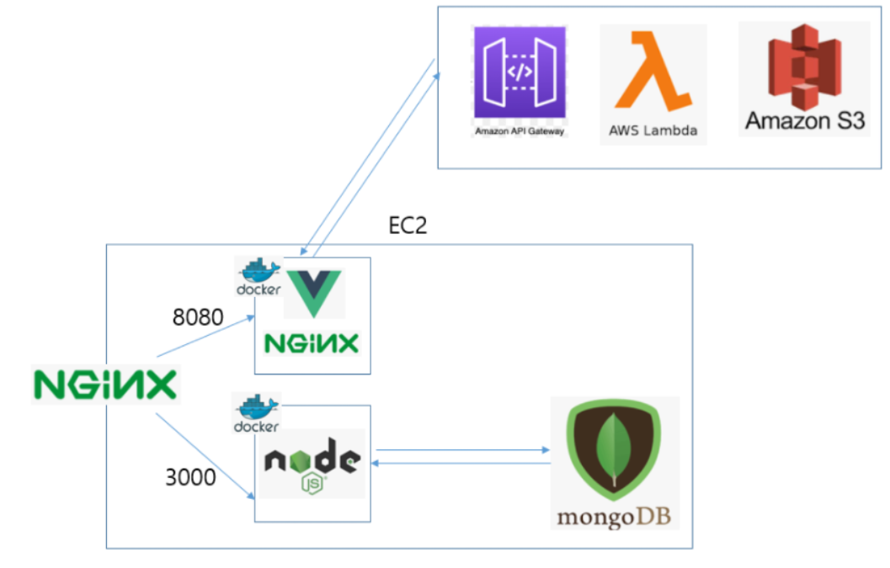

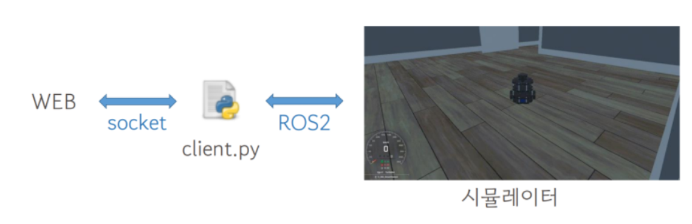

## 기술 스택

- 판단/제어: ROS2
- 인지: PyTorch, Yolo
- 커스텀 맵: Unity
- 웹: Node.js
- 배포 : jenkins, docker, nginx

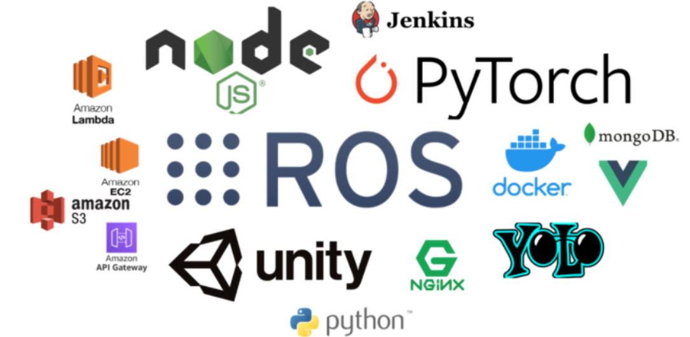

### hanbi

최종 시연에 필요한 파일들만 모아둔 패키지

launch 폴더의 hanbi_launch.py를 실행시키면 모두 실행됩니다.

a_star_local_path.py : a_star 노드를 통해서 생성한 경로의 지역 경로를 publish할 때 사용

a_star.py : a* 알고리즘을 통해서 최단 경로를 생성할 때 사용

[client.py](http://client.py) : Node JS 서버와 통신하는 노드(인지하면 웹에 로그 남기기, 웹에 카메라 영상을 전달 등)

load_map.py : 그리드맵을 불러올 때 사용

make_path.py : 경로를 생성할 때 사용

[odom.py](http://odom.py) : 오도메트리에 사용

path_pub.py : 생성한 경로를 불러올 때 사용

path_tracking_patrol.py: 지정된 경로를 따라서 순찰하며 인지 결과에 따라서 제어를 할 때 사용 (예를 들어 3명 이상의 사람들이 모여있다는 신호가 오면 그 근처까지 다가갔다가 지정된 경로로 복귀함)

[perception.py](http://perception.py) : 다수의 사람들이 모여있는지 체크할 때 사용

pytorch_detector.py : 인지 모델을 통한 객체 인식

run_mapping_custom.py : 맵 인식하고 소켓 전송하는 코드

[transform.py](http://transform.py) : 좌표 추정에 필요한 노드

socket_custom : 웹에 시뮬레이터 정보를 소켓 전송하는 코드

[tts.py](http://tts.py) : 안내 방송을 할 때 사용하는 노드

### **hanvi_interfaces**

ROS2 통신에 쓸 커스텀 메시지를 위한 패키지

## Jira

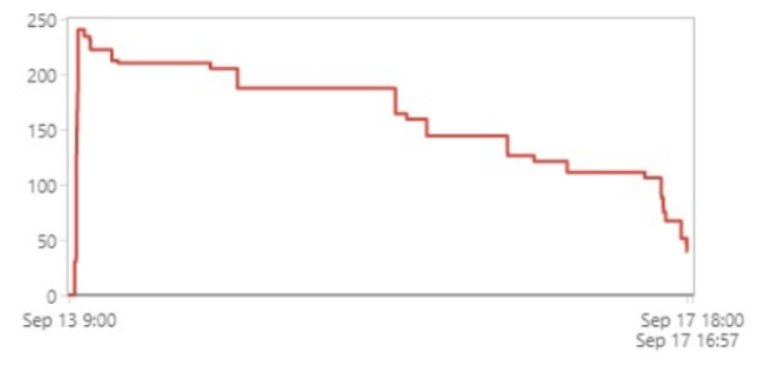

번다운 차트 예시는 위와 같습니다.

지라 규칙

개발 관련된 내용 : 스토리-서브스토리

개발 외적인 내용 : 태스크 (예를 들어, 발표 준비)

에픽을 배정했고 1인당 하루에 8시간씩 스토리포인트를 할당하여 개발했습니다.

# Git Convention

커밋 메시지

접두사 : 내용

| 접두사 | 내용      |
| ------ | --------- |
| feat   | 코드 작성 |
| fix    | 버그 수정 |
| docs   | 문서 수정 |
| deploy | 배포      |

각종 기능을 개발할 때 feat/loadMap과 같은 브랜치를 새로 만들어 개발하고

develop 브랜치에 merge request를 요청하는 방식으로 개발함

###   기능 상세 (시뮬레이션)

다수 인원 체크 : 한비가 지정된 경로를 순찰하다가 농구장에 몰려있는 사람들을 인식하고 그 근처까지 A* 알고리즘을 통해 접근 후 안내 방송을 TTS를 통해서 주고 지정된 경로로 복귀합니다.

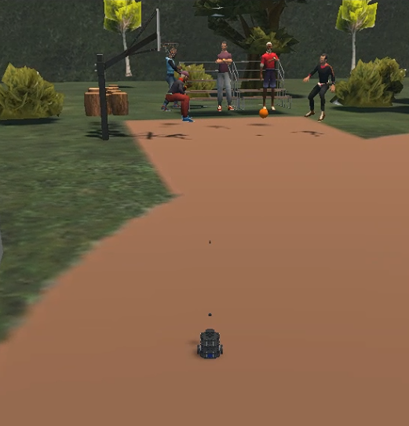

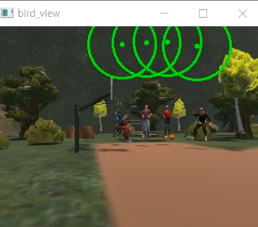

 

쓰레기 줍기 : 경로에 쓰레기로 인식되는 물체가 있으면 한비는 미리 설정해둔 쓰레기통의 위치에 가져다 놓고 경로로 복귀합니다. 순서대로 인식하는 모습, 쓰레기를 버리러 가는 모습, 내려놓고 복귀하는 모습입니다.

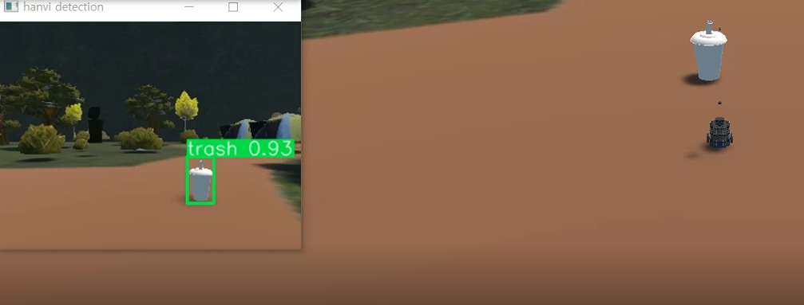

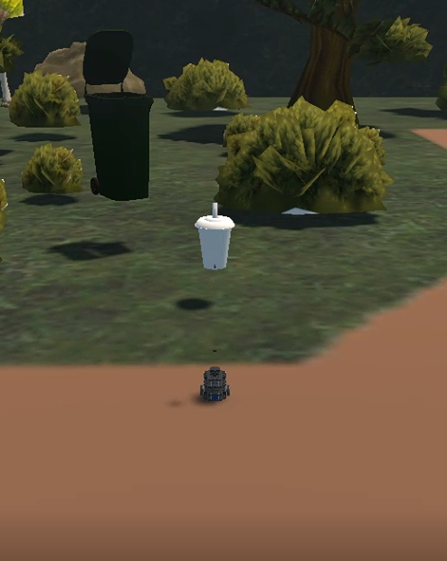

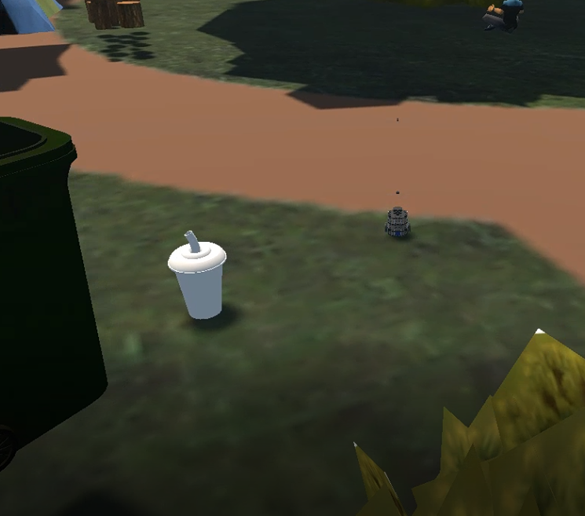

 

텐트 인식 : 한강 공원에서 텐트를 펴고 휴식을 즐기는 사람이 많았으나 코로나 시국에 텐트는 금지되고 있습니다. 텐트를 인식한 한비는 정리해달라는 안내방송을 보냅니다. 

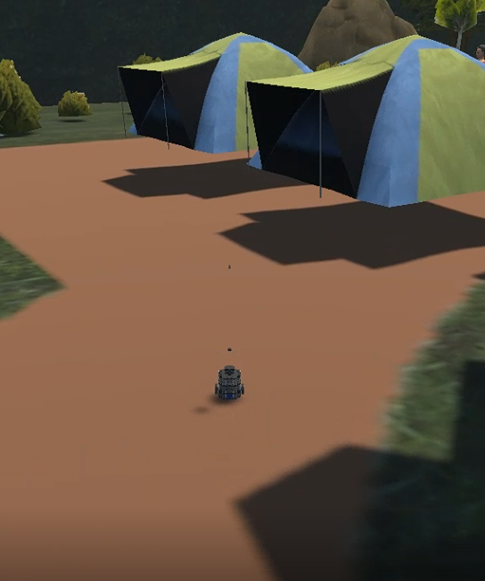

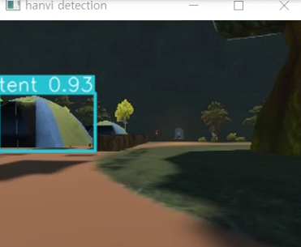

 

화재 감지 : 화재를 감지하면 웹사이트에 응급 로그가 생깁니다. (웹 관련 기능은 뒤에 적겠습니다.)

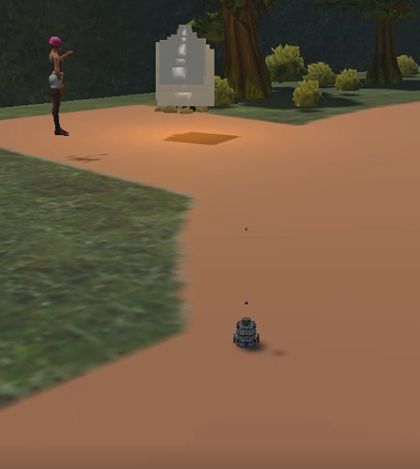

 

킥보드 : 지정된 위치가 아니라 도로에 세워진 킥보드는 서울시 정책에 의해서 견인 대상입니다. 웹에 일반 로그를 띄워줍니다.

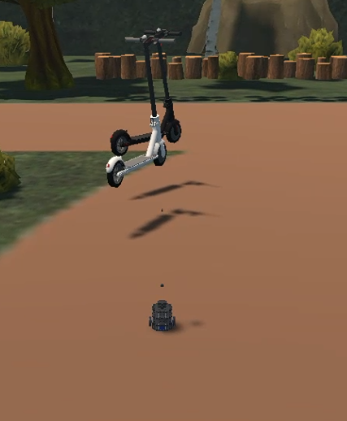

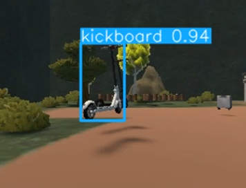

 

분실물 수거 : 경로에 가방으로 인식되는 물체가 있을 경우, 한비는 지정된 곳(관리사무소)으로 가져다 놓습니다. (쓰레기 줍기와 같은 로직입니다)

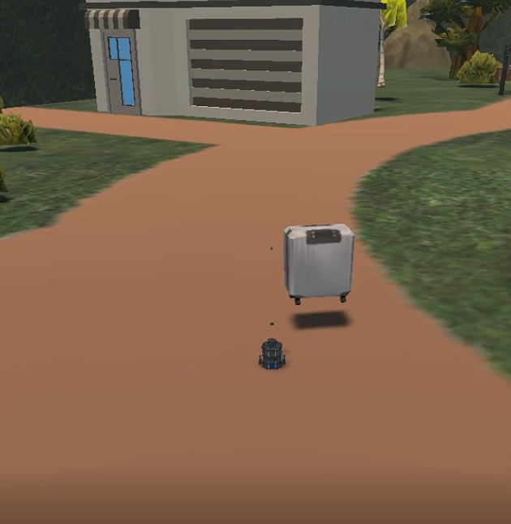

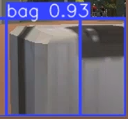

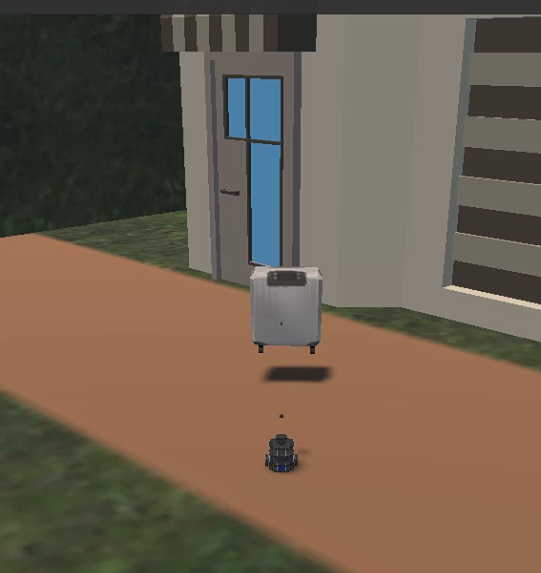

 

심야 음주 단속: 시연에서는 순찰을 마치고 정지해있는 한비에게 웹의 지도를 클릭해서 나무 근처로 가게합니다. 나무 근처에서 술병을 인식하고 술을 마시는 사람에게 술을 마시면 안 된다는 안내방송을 합니다.

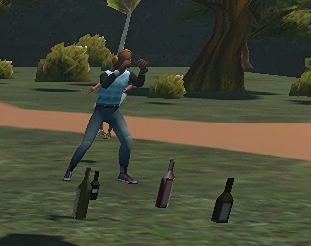

### 기능 상세 (웹)

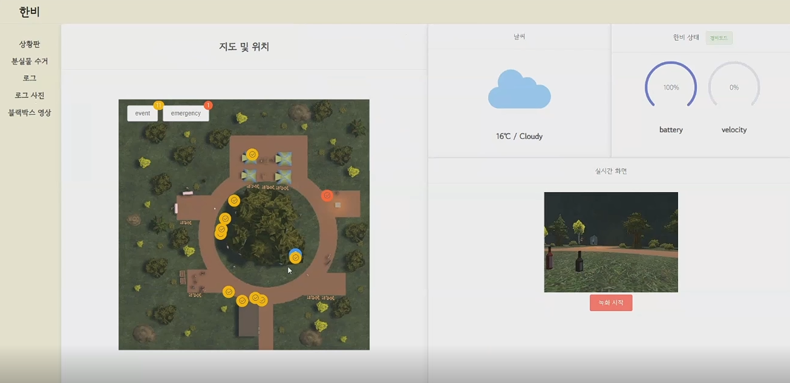

상황판 탭

지도에는 한비가 무언가를 인지했을 때 표시가 되는데 화재처럼 응급한 경우 빨간색 표시가 생기고 그 외는 노란색 표시가 생긴다. 또한 지도를 클릭해서 한비를 그곳으로 움직일 수 있습니다.

그리고 시뮬레이터에서 받아온 날씨 정보, 로봇 상태도 표시된다. 또한 실시간 화면이 웹에 나오고 녹화할 수도 있습니다.

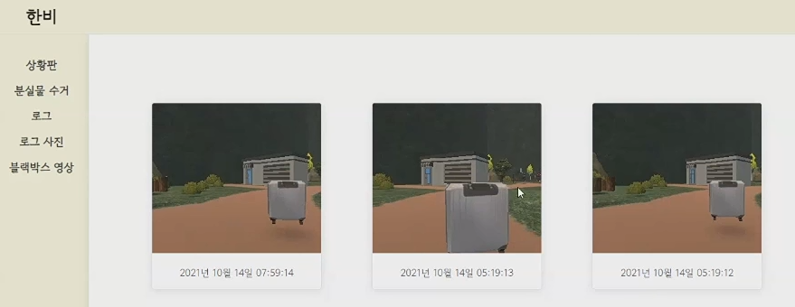

분실물 수거 탭

분실물일 경우 사진이 찍히고 이 탭에 저장된다.

 

로그 탭에는 맵 감지 현황과 로그가 찍힙니다.

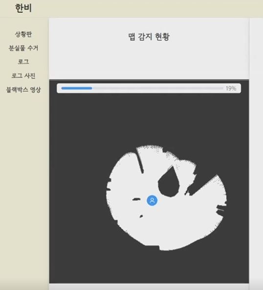

맵 감지 현황에는 라이다를 통해서 얻은 정보를 통해서 장애물을 확인할 수 있습니다.

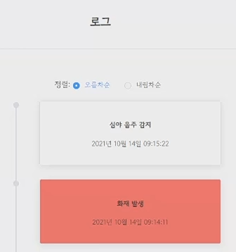

맵 감지 현황 옆에는 로그가 기록되는데 화재같은 응급 로그는 빨간색, 이외의 일반 로그는 하얀색으로 기록됩니다.

 

로그 사진 탭에는 분실물 수거, 쓰레기 줍기 이외의 이벤트에 대한 사진이 찍힙니다.

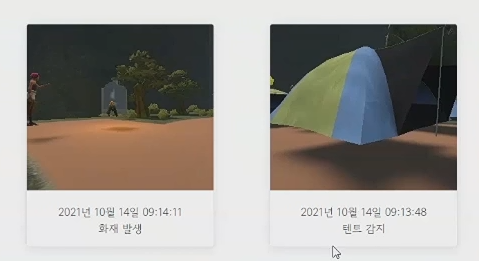

 

블랙 박스 탭에는 녹화한 영상들이 기록됩니다.

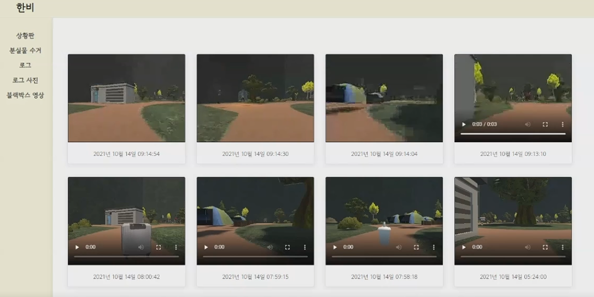

