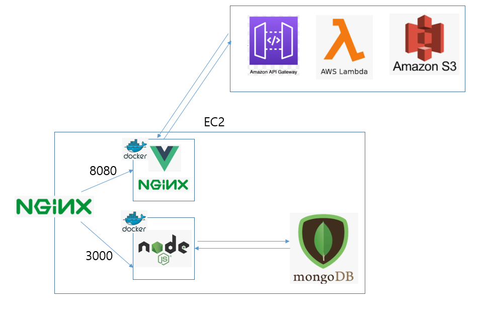
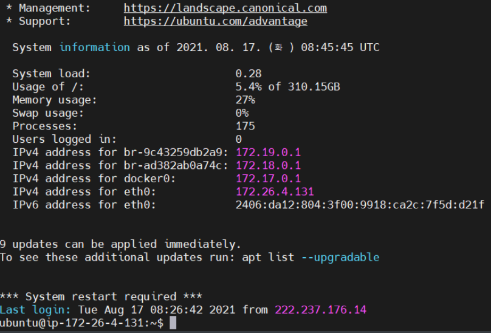
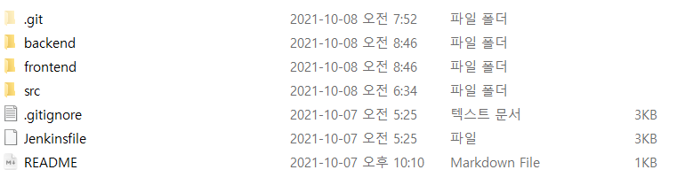
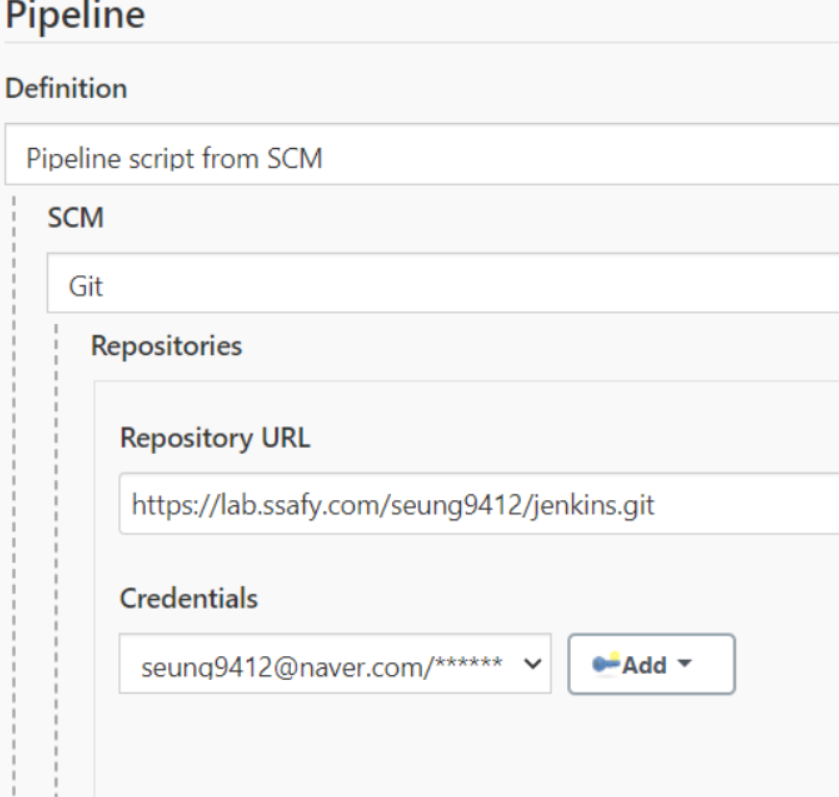
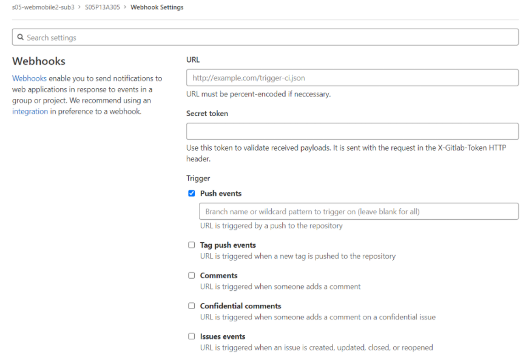
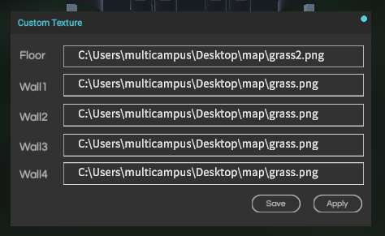
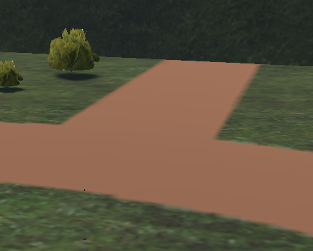

# 한비 porting manual



프론트, 백, 데이터베이스의 구조는 다음과 같습니다.

Node JS는 14.17.3 버전, Vue는 2버전을 사용했습니다.

현재 깃랩에 소스코드가 업로드된 상황이라고 생각하고 설명하겠습니다.

먼저, EC2 접속을 위해서 MobaXterm을 설치합니다. 컨설턴트님께 제공받은 pem 파일을 이용해서 EC2에 접속합니다.

먼저 EC2에 도커를 설치하고 젠킨스가 들어있는 컨테이너를 만들었는데 컨테이너 내부에서 도커 명령어를 쓸 수 있도록 설정했습니다.



이런 화면이 보이면 이제 도커를 설치합니다. 도커 공식 홈페이지 참조했고 명령어는 다음과 같습니다.

```
sudo apt-get update
sudo apt-get install \
    apt-transport-https \
    ca-certificates \
    curl \
    gnupg \
    lsb-release
```

```
curl -fsSL https://download.docker.com/linux/ubuntu/gpg | sudo apt-key add -
```

```
sudo add-apt-repository \
  "deb [arch=amd64] https://download.docker.com/linux/ubuntu \
  $(lsb_release -cs) \
  stable"
```

```
sudo apt-get update
sudo apt-get install docker-ce docker-ce-cli containerd.io
```

설치가 잘 되었는지 확인하기 위해서

```
sudo docker version
```

입력해서 잘 나오면 설치 완료입니다.

docker ps 명령어를 입력했는데 "Got permission denied while trying to connect to the Docker daemon socket" 같은 에러가 나올 경우 해결 방법은 다음과 같습니다.

```
sudo groupadd docker
sudo usermod -aG docker $USER
newgrp docker
```

이제 젠킨스가 들어있는 컨테이너를 만들어야 하는데 컨테이너 내부에서 도커 명령어를 쓸 수 있도록 설정합니다. 이를 위해서

```
sudo apt install docker-compose
```

docker-compose를 설치하고

pwd를 입력했을 때 /home/ubuntu/ 위치에서

Dockerfile, docker-compose.yml 만들기

jenkins_space 폴더를 만들고

```
FROM jenkins/jenkins
USER $USER
RUN curl -s https://get.docker.com/ | sh
RUN curl -L "https://github.com/docker/compose/releases/download/1.28.5/docker-compose-$(uname -s)-$(uname -m)" -o /usr/local/bin/docker-compose && \
    chmod +x /usr/local/bin/docker-compose && \
    ln -s /usr/local/bin/docker-compose /usr/bin/docker-compose
RUN curl -sL bit.ly/ralf_dcs -o ./dcs && \
    chmod 755 dcs && \
    mv dcs /usr/local/bin/dcs
RUN usermod -aG docker jenkins
```

```
version: '3'
services:
  jenkins:
    privileged: true
    build: .
    restart: always
    ports: 
      - "9090:8080"
      - "50000:50000"
    expose:
      - "9090"
      - "50000"
    volumes: 
      - './jenkins_space:/var/jenkins_home'
      - '/var/run/docker.sock:/var/run/docker.sock'
    environment:
      TZ: "Asia/Seoul"
```

그리고 아래의 명령어를 입력합니다.

```
docker-compose up -d
```


이제 MongoDB를 설치하겠습니다.

공통 프로젝트 때 DB를 컨테이너에 설치했다가 Exited된 경험이 있어서 EC2에 직접 설치했습니다.

설치 커맨드는 아래 사이트를 이용했습니다.

https://docs.mongodb.com/manual/tutorial/install-mongodb-on-ubuntu/

```
wget -qO - https://www.mongodb.org/static/pgp/server-5.0.asc | sudo apt-key add -
```

```
echo "deb [ arch=amd64,arm64 ] https://repo.mongodb.org/apt/ubuntu focal/mongodb-org/5.0 multiverse" | sudo tee /etc/apt/sources.list.d/mongodb-org-5.0.list
```

```
sudo apt-get update
```

```
sudo apt-get install -y mongodb-org
```


mongo 명령어를 입력하고 use hanbidb를 입력해준다. (사용할 db 이름)

그리고 Node JS 서버에서는

```
mongoose.connect("mongodb://j5a102.p.ssafy.io:27017/hanbidb");
```

위와 같이 적어준다.


프론트엔드와 백엔드를 배포할 때는 도커와 젠킨스를 사용했습니다.



backend 폴더에는 Dockerfile, frontend 폴더에는 Dockerfile과  nginx.conf 파일이 있다.

내용은 소스코드에서 보시면 됩니다.


위의 젠킨스 설치과정에 보면 9090번 포트를 설정해주었기 때문에

EC2의 ip주소 뒤에 :9090을 붙여서 젠킨스에 접속합니다.

로그인을 하고 기본 플러그인을 설치합니다.

젠킨스 관리-플러그인 관리에 들어가서 gitlab을 검색해서 gitlab 플러그인을 설치합니다.

파이프라인을 하나 만들고 파이프라인 탭에서 pipeline script from SCM 선택

SCM 유형에 Git 선택합니다.

현재 프로젝트가 깃랩에 업로드되어 있는데 clone with HTTPS 주소를 복사해서

Repository URL에 붙여넣기합니다.

ScriptPath에는 프로젝트에 있는 젠킨스파일 이름을 똑같이 적어주어야 한다. (대소문자 주의)

그래서 Jenkinsfile을 적습니다.

gitlab의 프로젝트가 private이면 에러가 납니다.

credentials-add-jenkins 누르고 정보를 입력합니다.

username에 깃랩 가입 이메일을 적으면 됩니다.



이런 식으로 나오도록 합니다.

Branches to build에는

*/master을 적습니다.

이제 웹훅을 만들겠습니다.

파이프라인에 Build Triggers를 깃랩으로 설정해주고 옆에 적힌 주소를 복사합니다.

깃랩 프로젝트에 들어가서 왼쪽 탭에서

Settings를 누르고 Webhook를 누릅니다.

URL에 주소를 붙여넣습니다.

다시 젠킨스 페이지로 가서 

고급 누르고 씨크릿 토큰을  generate한 후에

복사해서

깃랩 페이지의 Secret token에 붙여넣습니다.

밑으로 내려가서 Add webhook을 누릅니다.



URL, Secret token을 붙여넣었으면

Push events 밑에 master를 입력합니다.

이렇게 젠킨스와 깃랩을 연결했습니다.


싸피 측에서 제공하는 시뮬레이터를 설치하시고

포팅메뉴얼과 같은 위치에 있는 Extra 폴더를 압축 풀고 아래 위치에 놓습니다.

```
C:\Users\multicampus\Desktop\SSAFYLauncher_SSAFY_Win\SSAFYLauncher_SSAFY_Win_Data\Bundle\v.4.5.210806.H4
```

map 폴더는 바탕화면에 풉니다.

json 파일은

```
C:\Users\multicampus\Desktop\SSAFYLauncher_SSAFY_Win\SSAFYLauncher_SSAFY_Win_Data\SaveFile\Scenario\V_IND_SSAFY_CustomMap
```

위치에 넣습니다.


시뮬레이터를 켜고 커스텀 맵을 선택합니다.

왼쪽 위 탭의 SSAFY를 클릭하고 위의 json 파일을 불러옵니다.

그리고 Custom Map Texture을 클릭하고 아래와 같이 map 폴더의 내용물을 넣어줍니다.



그 후 시작 위치에서 sub2의 odom 노드를 실행합니다.

그리고 출발 위치로 이동합니다.



make_path 노드를 통해서 원하는 경로를 만듭니다.

그리고 path_pub, load_map, odom, a_star, a_star, a_star_local_path 등의 노드를 이용해서 주행합니다. 순찰을 할 때는 path_tracking_patrol, 쓰레기 줍기와 분실물 수거를 할 때는 path_tracking_clean을 활용합니다.

exec 폴더에 pretrained weight 파일, 환경 파일, 이미지 셋을 함께 첨부합니다.

TTS 기능을 사용하려면 pip install pygame 명령어를 입력하여 pygame을 설치해주어야 합니다.